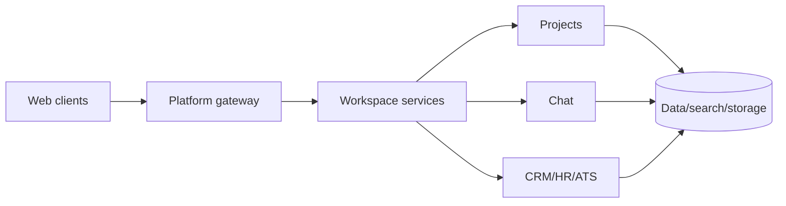

# 🚀 Enterprise Collaboration Workspace (Huly Platform)

**A modular collaboration platform spanning chat, projects, CRM, HRM and applicant tracking.**

[English](#english) · [فارسی](#فارسی) · [العربية](#العربية) · [Build Guide](./BUILD.md)

> [!IMPORTANT]
> **Verified repository status:** Large upstream monorepo; substantial build resources required

## 🧭 Architecture

---

## English

### 📌 Overview

A modular collaboration platform spanning chat, projects, CRM, HRM and applicant tracking.

This README is based on the current public source, dependency manifests, container files and runnable entry points. Implemented functionality is separated from roadmap claims, and known limitations are recorded instead of being hidden behind generic setup instructions.

### ✨ Core capabilities

- Unified workspace/chat
- Project and document collaboration
- CRM/HR/ATS apps
- Typed API and Docker development

### 🧱 Technology stack

| Layer | Technology |
|---|---|
| Monorepo | Microsoft Rush, TypeScript |
| Runtime | Node.js 20.11 |
| Infrastructure | Docker Compose |
| Services | MongoDB, Elasticsearch, MinIO and platform services |

### 🔄 Operating model

1. Prepare the runtime and external services documented in [BUILD.md](./BUILD.md).
2. Configure secrets in local environment files or a secret manager; never commit them.
3. Start infrastructure and backend services before the user interface in multi-service projects.
4. Validate health checks, migrations, model files and provider connectivity.
5. Run tests and domain-specific validation before producing a release artifact.

### 🔐 Security, quality and limitations

- Build can require tens of GB and high memory
- Use upstream self-host repo for deployment

### 🛠 Build and deployment

Use **[BUILD.md](./BUILD.md)** for verified prerequisites, development commands, production build steps, tests and troubleshooting.

### 📄 Attribution and license

This repository contains the Huly Platform from HC Engineering. Preserve upstream copyright, license, branding and contributors.

---

## فارسی

### 📌 معرفی پروژه

پلتفرم همکاری ماژولار شامل چت، پروژه، CRM، HRM و رهگیری متقاضی.

این مستند بر اساس سورس عمومی فعلی، فایل‌های وابستگی، تنظیمات کانتینر و نقاط ورود قابل مشاهده تهیه شده است. قابلیت‌های پیاده‌سازی‌شده از موارد نقشه راه جدا شده‌اند و محدودیت‌های واقعی Build به‌صورت شفاف ثبت شده‌اند.

### ✨ قابلیت‌های اصلی

- فضای کاری و چت
- همکاری پروژه و سند
- برنامه‌های CRM/HR/ATS
- API تایپ‌شده و Docker

### 🧱 پشته فناوری

| Layer | Technology |
|---|---|
| Monorepo | Microsoft Rush, TypeScript |
| Runtime | Node.js 20.11 |
| Infrastructure | Docker Compose |
| Services | MongoDB, Elasticsearch, MinIO and platform services |

### 🔄 روند اجرا

۱. پیش‌نیازها و سرویس‌های بیرونی مندرج در [BUILD.md](./BUILD.md) را آماده کنید.  
۲. کلیدها را فقط در فایل محیطی خارج از Git یا Secret Manager نگه دارید.  
۳. در پروژه چندسرویسی، ابتدا دیتابیس، صف و بک‌اند و سپس رابط کاربری را اجرا کنید.  
۴. Health Check، Migration، فایل مدل و اتصال Providerها را بررسی کنید.  
۵. پیش از انتشار، تست فنی و اعتبارسنجی تخصصی حوزه را انجام دهید.

### 🔐 امنیت و محدودیت

- نسخه Runtime و Dependencyها را با Lockfile تثبیت کنید.
- اطلاعات شخصی، فایل آپلودی، کلید API و داده واقعی نباید وارد مخزن عمومی شود.
- ادعاهای دقت، امنیت یا آمادگی Production باید در محیط هدف دوباره ارزیابی شوند.
- محدودیت‌های اختصاصی پروژه در بخش انگلیسی بالا و `BUILD.md` ثبت شده‌اند.

### 🛠 نصب و Build

راهنمای کامل و دستورات قابل کپی در **[BUILD.md](./BUILD.md)** قرار دارد.

### 📄 مجوز و مالکیت

فایل `LICENSE`، اعتبار توسعه‌دهندگان اصلی و مجوز کتابخانه‌های ثالث باید حفظ شود. در پروژه‌های upstream یا fork، مالکیت به سازمان بارمانا منتقل نمی‌شود.

---

## العربية

### 📌 نظرة عامة

منصة تعاون معيارية تشمل المحادثة والمشاريع وCRM وHRM وتتبع المتقدمين.

أُعد هذا التوثيق اعتماداً على المصدر العام الحالي وملفات التبعيات والحاويات ونقاط التشغيل المتاحة. وهو يميز بين الوظائف المنفذة وخارطة الطريق ويذكر قيود البناء الفعلية بوضوح.

### ✨ القدرات الأساسية

- مساحة عمل ومحادثة
- تعاون مشاريع ومستندات
- تطبيقات CRM/HR/ATS
- API typed وDocker

### 🧱 التقنيات

| Layer | Technology |
|---|---|
| Monorepo | Microsoft Rush, TypeScript |
| Runtime | Node.js 20.11 |
| Infrastructure | Docker Compose |
| Services | MongoDB, Elasticsearch, MinIO and platform services |

### 🔄 مسار التشغيل

١. جهز المتطلبات والخدمات الخارجية الواردة في [BUILD.md](./BUILD.md).  
٢. احتفظ بالأسرار في ملف بيئة غير متتبع أو مدير أسرار.  
٣. شغّل قواعد البيانات والطوابير والخلفية قبل الواجهة في الأنظمة متعددة الخدمات.  
٤. تحقق من الصحة والترحيلات وملفات النماذج واتصال المزوّدين.  
٥. نفذ الاختبارات والتحقق المتخصص قبل إصدار نسخة للنشر.

### 🔐 الأمان والقيود

- ثبّت إصدارات التشغيل والتبعيات بملفات القفل.
- لا تضع بيانات شخصية أو ملفات مرفوعة أو مفاتيح API في مستودع عام.
- أعد التحقق من ادعاءات الدقة والأمان والجاهزية في بيئة الهدف.
- القيود الخاصة بالمشروع موثقة في القسم الإنجليزي و`BUILD.md`.

### 🛠 البناء والنشر

توجد التعليمات الكاملة والأوامر القابلة للنسخ في **[BUILD.md](./BUILD.md)**.

### 📄 النسب والترخيص

يجب الحفاظ على `LICENSE` وحقوق المطورين الأصليين وتراخيص المكونات الخارجية. وجود نسخة أو fork لا ينقل ملكية المصدر إلى Barmana-BRM.

---

Made documentation-ready for the public portfolio of **Barmana-BRM**

